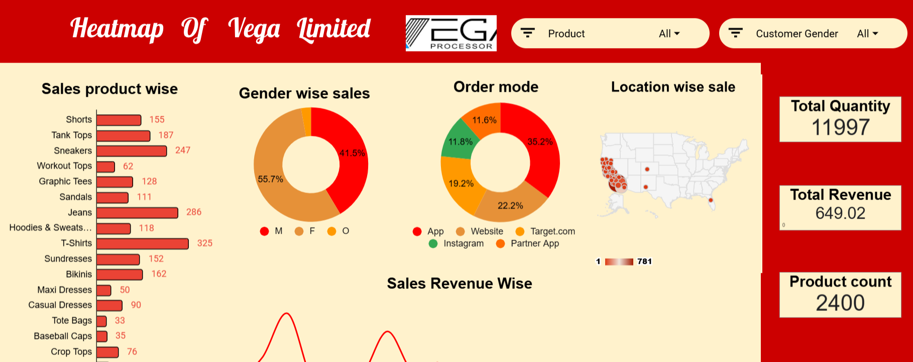
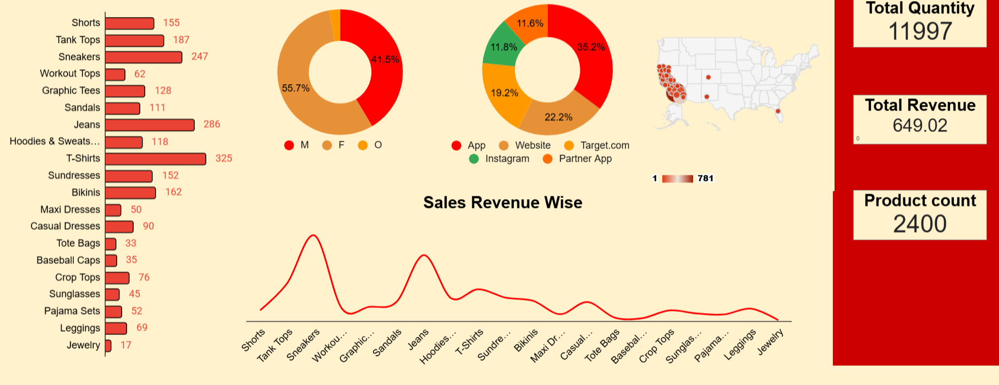

#  Heatmap of Vega Limited – Sales Analytics Dashboard




An interactive Power BI / Excel dashboard built for **Vega Limited**, analyzing fashion retail sales performance across products, gender, order channels, and US locations.

---

## Problem Statement

Vega Limited, a US-based fashion retail brand, needed a comprehensive visual dashboard to monitor sales performance across its wide product range. The management required insights into:

- Which **products** generate the highest quantity sold and revenue
- How **customer gender** influences purchasing patterns
- Which **order channels** (App, Website, Target.com, Instagram, Partner App) drive the most orders
- Which **geographic locations** across the US have the highest sales concentration
- How **revenue varies** across different product categories in a trend view

The goal was to create a heatmap-style interactive dashboard with filters for **Product** and **Customer Gender** to allow drill-down analysis and support strategic decisions around marketing, inventory, and channel investment.

---

##  Dashboard Preview

### Part 1 – Overview


### Part 2 – Full Product & Revenue View


---

##  Key Metrics

| Metric | Value |
|--------|-------|
| Total Quantity | 11,997 |
| Total Revenue | $649.02K |
| Product Count | 2,400 |

---

##  Charts & Visuals

### 1. Sales Product Wise
- **Type:** Horizontal Bar Chart
- **Insight:** T-Shirts lead with 325 units sold, followed by Jeans (286) and Sneakers (247). Jewelry (17) and Tote Bags (33) are the lowest sellers.

### 2. Gender Wise Sales
- **Type:** Donut Chart
- **Insight:** Female customers dominate at 55.7%, Males account for 41.5%, and Other gender is 2.8%.

### 3. Order Mode
- **Type:** Donut Chart
- **Insight:** Website is the top order channel at 35.2%, followed by Target.com (22.2%), Partner App (19.2%), Instagram (11.8%), and App (11.6%).

### 4. Location Wise Sale
- **Type:** US Heatmap
- **Insight:** Sales are heavily concentrated along the **California coast** and a few scattered locations in the eastern US, with density ranging from 1 to 781.

### 5. Sales Revenue Wise
- **Type:** Line Chart
- **Insight:** Sneakers and Jeans show the highest revenue peaks. Products like Jewelry, Tote Bags, and Maxi Dresses show the lowest revenue.

---

##  Key Questions Answered

1. Which product has the highest sales quantity?
2. What is the gender distribution of customers?
3. Which order channel generates the most orders?
4. Which US locations have the highest sales concentration?
5. Which products generate the most revenue vs. least?
6. How does revenue vary across the full product catalog?

---

##  Dashboard Filters

| Filter | Options |
|--------|---------|
| Product | All / Individual product selection |
| Customer Gender | All / Male / Female / Other |

---

## 🗂️ Files

| File | Description |
|------|-------------|
| `heatmappart1.png` | Dashboard screenshot – top section |
| `heatmappart2.png` | Dashboard screenshot – full product view |
| `README.md` | This file |

> 📎 **Data Source:** [Google Sheets – Vega Limited Sales Data](https://docs.google.com/spreadsheets/d/12vIMF5pPFYQTTkn7G7IG8r3EQQRzYhmjA1x8LCDWEvQ/edit?gid=1705929557#gid=1705929557)

---

##  Tools Used

- **Power BI / Excel** – Dashboard, Charts, Heatmap, Slicers
- **Google Sheets** – Source data storage
- **US Map Visual** – Geographic heatmap of sales density

---

##  Getting Started

1. Clone or download this repository
   ```bash
   git clone https://github.com/your-username/your-repo-name.git
   ```
2. Open the [Google Sheets data source](https://docs.google.com/spreadsheets/d/12vIMF5pPFYQTTkn7G7IG8r3EQQRzYhmjA1x8LCDWEvQ/edit?gid=1705929557#gid=1705929557)
3. Open the dashboard file in **Power BI Desktop** or **Excel**
4. Use the **Product** and **Customer Gender** filters to explore the data interactively
